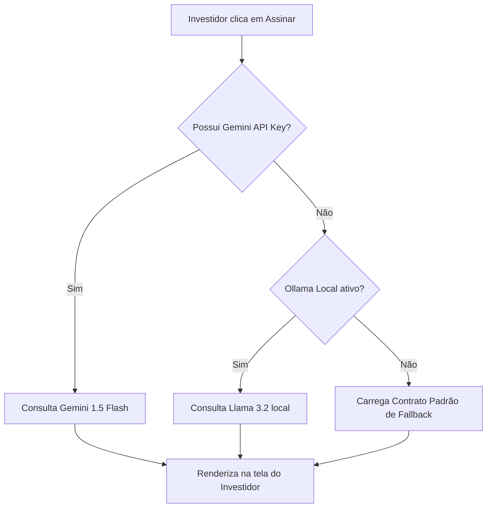

# 🤖 Documentação: Contrato de Investimento Gerado por IA

**Autor:** Barba-Branca  
**Data:** 02/07/2026  
**Status:** Implementado e Homologado  

---

## 📌 Visão Geral

Esta documentação descreve a tecnologia de geração dinâmica de contratos jurídicos via Inteligência Artificial integrada ao módulo de assinatura eletrônica do projeto **New Start-se**. Em vez de exibir contratos estáticos com textos padrão (Lorem Ipsum), a plataforma agora redige um **Contrato de Mútuo Conversível** personalizado para cada transação e investidor em tempo real.

---

## ⚙️ Funcionamento Técnico

O fluxo de geração do contrato dinâmico está integrado na view de assinaturas em `investidores/views.py`:

### 1. Parâmetros de Entrada da Análise
A IA recebe os metadados da transação extraídos diretamente do banco de dados:
* **Nome do Investidor** (para qualificação das partes).
* **Nome da Startup** (empresa que está captando recursos).
* **Valor do Aporte** (formatado em Real R$).
* **Percentual de Participação (Equity)** negociado.
* **Estágio Atual da Startup** (Idea, MVP, Scalable, etc.).

### 2. O Prompt de Engenharia Jurídica
O prompt instrui a IA a agir como um advogado especialista em direito de startups e societário brasileiro, gerando cláusulas estruturadas cobrindo:
- **Cláusula Primeira:** Objeto do Mútuo.
- **Cláusula Segunda:** Condições financeiras e aporte.
- **Cláusula Terceira:** Gatilhos e prazos para conversão em participação societária.
- **Cláusula Quarta:** Confidencialidade das informações (NDA).
- **Cláusula Quinta:** Foro da Comarca de São Paulo/SP para solução de disputas.

A IA é instruída a retornar o resultado formatado estritamente em **HTML limpo** (utilizando tags sem estilos Inline como `<h4>`, `
`, `<ol>`, `<li>`, `<strong>`), garantindo compatibilidade estética imediata com o tema escuro da plataforma.

### 3. Mecanismo de Redundância (Fallback Seguro)
Para garantir que a operação do investidor nunca seja interrompida (por limites de quota de API ou indisponibilidade de internet):
- Se a chamada à API do Gemini falhar, o sistema aciona o **Ollama local** na máquina.
- Se o Ollama local também estiver offline ou demorar a responder, o sistema utiliza um **contrato padrão robusto em formato HTML** embutido no código como plano B.

---

## 📂 Arquivos Relacionados
* **[views.py](file:///c:/Users/Kaue_Martins/Desktop/New-startse-main/investidores/views.py):** Função `gerar_contrato_com_ia` que chama as APIs de LLM e a view `assinar_contrato` que passa o texto para o contexto da página.
* **[assinar_contrato.html](file:///c:/Users/Kaue_Martins/Desktop/New-startse-main/investidores/templates/assinar_contrato.html):** Renderiza o contrato utilizando o filtro `{{ contrato_texto|safe }}` em uma caixa rolável e responsiva.
