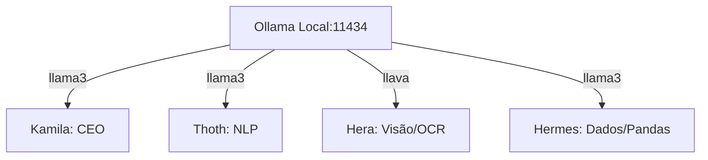
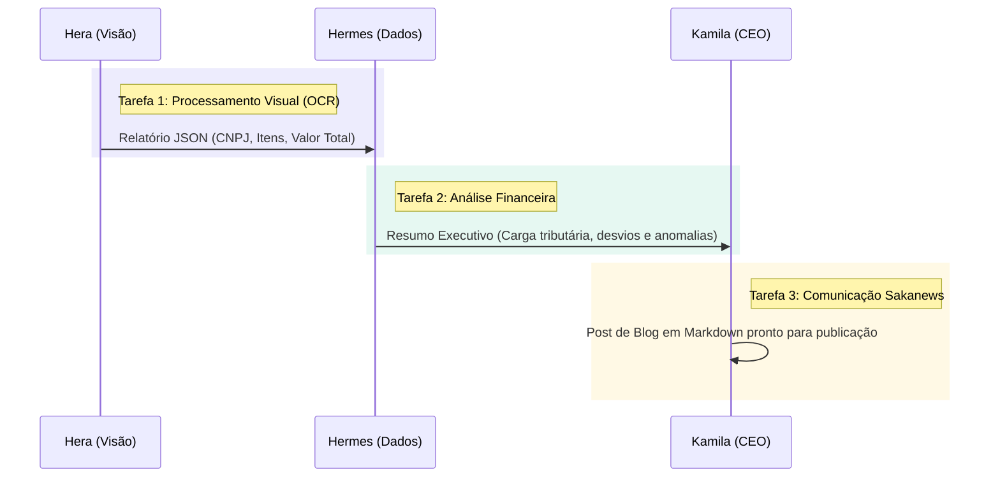

# Documentação Técnica: Sistema S.A.K.A. (AI Agent Crew)

O **S.A.K.A. (Sistema de Agentes Kamila Autônomos)** é um módulo autônomo baseado no framework **CrewAI** para orquestração de multi-agentes inteligentes que cooperam em tarefas complexas de auditoria, análise de dados e redação de conteúdo estratégico.

---

## 1. Arquitetura dos Agentes (`agents.py`)

O sistema define quatro agentes com personalidades, objetivos e capacidades técnicas distintas, rodando localmente na infraestrutura através de LLMs integradas via **LangChain Ollama**:

### 🧠 LLM Base (Ollama local na porta `11434`)
- **`llama3`**: Utilizado para tarefas lógicas de raciocínio, análise de dados e redação de texto (Kamila, Thoth e Hermes).
- **`llava`**: Modelo multimodal com capacidade de visão computacional, utilizado para extração visual e OCR (Hera).



### Detalhamento dos Perfis:

| Agente | Papel (Role) | Objetivo (Goal) | LLM | Delegação |
| :--- | :--- | :--- | :--- | :--- |
| **Kamila** | CEO / Orquestradora | Coordenar os agentes Thoth, Hera e Hermes para entregar análises de alto nível e estratégia final. | `llama3` | Ativada (`True`) |
| **Thoth** | Especialista NLP | Processar grandes volumes de texto, extrair insights e garantir a precisão semântica. | `llama3` | Desativada (`False`) |
| **Hera** | Analista de Visão | Analisar imagens de notas fiscais, recibos, documentos e extrair dados visuais. | `llava` | Desativada (`False`) |
| **Hermes** | Cientista de Dados | Conectar em bases de dados, realizar cálculos complexos com Pandas e gerar relatórios. | `llama3` | Desativada (`False`) |

---

## 2. Orquestração de Tarefas (`tasks.py`)

As tarefas do S.A.K.A. são estruturadas sequencialmente, onde a saída de uma tarefa serve como insumo (contexto) para a próxima:



### Descrição das Tarefas:

1. **`task_ocr_fiscal` (Hera)**:
   - **Ação**: Executa leitura óptica na imagem da nota fiscal.
   - **Saída Esperada**: Relatório JSON estruturado contendo CNPJ do emissor, lista de produtos com valores individuais e o total da transação.
2. **`task_analise_financeira` (Hermes)**:
   - **Contexto**: Ingestão direta dos dados extraídos pela Hera.
   - **Ação**: Calcula a carga tributária estimada, compara com orçamentos simulados e acusa possíveis desvios/anomalias nos preços praticados.
   - **Saída Esperada**: Resumo executivo contendo a auditoria financeira da transação.
3. **`task_gerar_post` (Kamila/Thoth)**:
   - **Contexto**: Ingestão da auditoria consolidada do Hermes.
   - **Ação**: Criação de um artigo de blog no tom institucional promovendo a eficiência operacional do sistema S.A.K.A.
   - **Saída Esperada**: Post formatado em Markdown para o blog **Sakanews**.

---

## 3. Inicialização e Fluxo do Processo (`main.py`)

A classe `Crew` do CrewAI coordena a execução sequencial:
```python
saka_crew = Crew(
    agents=[kamila, thoth, hera, hermes],
    tasks=[task_ocr_fiscal, task_analise_financeira, task_gerar_post],
    process=Process.sequential,
    verbose=True
)
```
A execução é iniciada chamando a função `kickoff()` exportada no método `iniciar_sistema()`.

---

## 4. Guia de Instalação e VPS Azure (`setup_vps.sh`)

O arquivo [setup_vps.sh](file:///c:/Users/Kaue_Martins/Desktop/New-startse-main/saka_system/setup_vps.sh) é o script de instalação automatizada ideal para servidores Ubuntu 22.04+ hospedados na nuvem Azure.

### Etapas de Instalação Executadas pelo Script:
1. **Atualização**: Atualização completa de repositórios APT do sistema.
2. **Ferramentas**: Instalação de Python 3 pip, venv, curl, git e compilers.
3. **Ollama**: Instalação e inicialização do Ollama local.
4. **Firewall e Conectividade**:
   - Liberação de tráfego na porta padrão do Ollama (`11434/tcp`).
   - Configuração de escuta em qualquer interface (`OLLAMA_HOST=0.0.0.0`) via override do Systemd.
5. **Modelos**: Download automático de `llama3` e `llava`.
6. **Ambiente Python**: Criação de venv local e instalação automática das bibliotecas especificadas no `requirements.txt`.

### Como rodar em Produção:
```bash
# Entrar no diretório do sistema saka
cd saka_system

# Executar a instalação automatizada (apenas na primeira vez)
chmod +x setup_vps.sh
sudo ./setup_vps.sh

# Ativar ambiente e rodar
source venv/bin/activate
python main.py
```

> [!IMPORTANT]
> **Configuração de Rede Azure**: Lembre-se de criar uma regra de entrada (Inbound Port Rule) no **Network Security Group (NSG)** da sua máquina virtual no Portal do Azure para liberar tráfego na porta **11434** para que as requisições cheguem ao servidor local do Ollama caso acione chamadas a partir de outras máquinas.
