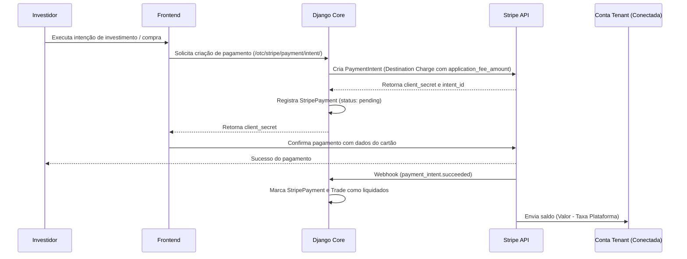

# 💳 Integração Stripe Connect Custom - New Start-se

Este guia documenta a integração de pagamentos utilizando **Stripe Connect (Custom Accounts)**, permitindo split de pagamentos instantâneo entre a plataforma e as mesas de negociação (Tenants).

---

## 🏗️ Arquitetura de Pagamentos

A plataforma utiliza o modelo **Stripe Connect Custom**, onde os donos de mesa (Tenants) atuam como "Merchants of Record". As transações (Destination Charges) são criadas na conta da plataforma central e transferidas diretamente para a conta conectada do Tenant, com a taxa de intermediação deduzida de forma automática.



---

## ⚙️ Variáveis de Ambiente (.env)

Configure as seguintes chaves no seu arquivo `.env`:

```dotenv
# Stripe Config
STRIPE_PUBLIC_KEY=pk_test_...
STRIPE_SECRET_KEY=sk_test_...
STRIPE_WEBHOOK_SECRET=whsec_...
```

---

## 1. Modelos de Dados (`otc/stripe_models.py`)

A infraestrutura possui os seguintes modelos auxiliares:

*   **`StripeAccount`**: Vincula um `TenantProfile` ao ID da conta conectada na Stripe e rastreia o progresso do onboarding de KYC.
*   **`StripePayment`**: Registra as transações com valores brutos, taxas da plataforma (`platform_fee`), e valores líquidos transferidos ao Tenant.
*   **`PlatformFee`**: Permite gerenciar as taxas da plataforma (fixa + percentual) dinamicamente.
*   **`StripeCustomer`**: Mapeia usuários locais (Investidores) aos IDs de clientes na base da Stripe.

---

## 2. Fluxo de Onboarding do Tenant (KYC/AML)

Para que o dono da mesa possa receber pagamentos, ele deve concluir o processo de onboarding exigido pela Stripe:

1.  **Geração do Link de Cadastro**: Acesse a rota `/otc/stripe/onboarding/`. A plataforma criará uma conta conectada do tipo `custom` e gerará um link temporário (`stripe.AccountLink`).
2.  **Redirecionamento**: O usuário preenche os dados exigidos pela Stripe (documentos, endereço, conta bancária).
3.  **Retorno**: Ao concluir, ele é redirecionado para `/otc/stripe/onboarding/callback/`, onde a plataforma verifica se os requisitos foram atendidos e atualiza o status local para `onboarding_complete = True`.

---

## 3. Split de Pagamento (Destination Charges)

Ao processar uma transação, criamos um `PaymentIntent` definindo a conta de destino e a taxa de aplicação:

```python
intent = stripe.PaymentIntent.create(
    amount=amount_cents,                 # Valor total pago pelo investidor (em centavos)
    currency='brl',
    customer=customer_id,
    application_fee_amount=fee_cents,    # Taxa retida pela plataforma (em centavos)
    transfer_data={
        'destination': connected_acct_id # Conta do Tenant que receberá o saldo
    },
    metadata={
        'trade_id': trade.id
    }
)
```

---

## 4. Webhooks de Sincronização

Configure um endpoint na Stripe apontando para:
`https://seudominio.com/otc/stripe/webhook/`

Os principais eventos ouvidos são:

*   **`payment_intent.succeeded`**: Atualiza o status do pagamento para `succeeded` e preenche o hash de liquidação (`tx_hash`) no modelo `Trade`.
*   **`payment_intent.payment_failed`**: Atualiza o status para `failed`.
*   **`account.updated`**: Sincroniza o status de onboarding e verificação de KYC da conta conectada do Tenant.

---

## 5. Cobrança de Mensalidades (SaaS)

Para cobrar os Tenants pelas mensalidades da infraestrutura, a plataforma utiliza `SetupIntents`:

1.  O Tenant insere as informações de pagamento na plataforma central.
2.  A plataforma inicia um `SetupIntent` definindo `usage='off_session'` para salvar o cartão na base da Stripe de forma segura.
3.  Nas cobranças recorrentes subsequentes, a plataforma realiza cobranças automáticas utilizando o método de pagamento salvo sem a necessidade de intervenção manual do Tenant.

---

## 🔒 Considerações de Segurança

1.  **Assinatura de Webhooks**: Sempre valide o cabeçalho `HTTP_STRIPE_SIGNATURE` utilizando o segredo `STRIPE_WEBHOOK_SECRET` para prevenir requisições falsificadas (CSRF/Spoofing).
2.  **Chaves Privadas**: Nunca commite chaves de produção (`sk_live_...`). Sempre utilize variáveis de ambiente secretas.
3.  **SSL/TLS**: Exija conexões seguras (HTTPS) para todas as requisições que lidam com endpoints financeiros.
