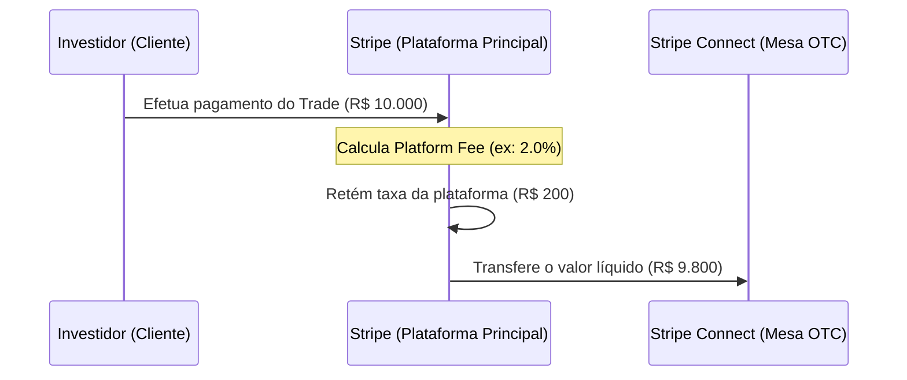

# 💳 Documentação: Substituição para Gateway de Pagamento Stripe (Connect Split)

**Autor:** Barba-Branca  
**Data:** 02/07/2026  
**Status:** Implementado  

---

## 📌 Visão Geral

Esta documentação descreve a implementação do **Stripe** como gateway unificado de pagamentos na plataforma **New Start-se**. Além de gerenciar transações e planos, a arquitetura do Stripe foi integrada no modelo **White Label** para mesas de negociação OTC utilizando a tecnologia **Stripe Connect (Destination Charges)** para o split automático de taxas.

---

## 🏗️ Arquitetura de Split de Pagamento (Stripe Connect)

O fluxo financeiro das operações OTC exige que o montante da transação seja transferido para a mesa operadora (Tenant), descontando a comissão de uso (taxa) pertencente à plataforma.

### Componentes Técnicos Implementados (`otc/views.py` e `otc/stripe_models.py`):

1. **Onboarding da Mesa (`stripe_onboarding`):**
   - O dono da mesa OTC é redirecionado para a página do Stripe Express/Custom para realizar o processo de KYC (Know Your Customer) e vincular sua conta bancária.
   - O status é registrado em `StripeAccount` no campo `onboarding_complete`.

2. **Criação do Intento de Pagamento (`create_payment_intent`):**
   - Cria um `PaymentIntent` no Stripe utilizando **Destination Charges**.
   - **`amount`**: O valor total da cotação travada no RFQ.
   - **`application_fee_amount`**: O split de pagamento calculado com base nas regras ativas de `PlatformFee` (ex: 2%). Esse valor é retido na sua conta principal.
   - **`transfer_data[destination]`**: A conta do Stripe Connect vinculada à mesa operadora, que recebe o restante do dinheiro instantaneamente.

3. **Webhooks de Sincronização (`stripe_webhook`):**
   - Ouve o evento `payment_intent.succeeded` enviado pelo Stripe para marcar o `StripePayment` e o `Trade` correspondentes como liquidados e bem-sucedidos.

---

## 🎁 Fluxo de Plano Promocional (Pro Trial 7 Dias)

Para simplificar a entrada de usuários e acelerar o onboarding, os planos antigos pagos via Mercado Pago foram substituídos pelo **Plano Pro Trial**:

- **7 Dias de Acesso Grátis:** O investidor ou empresário ativa o plano promocional na landing page (`index.html`) sem necessidade de preencher cartões de crédito na fase Beta.
- **Funções Liberadas:** Startups ilimitadas, acesso ao Data Room, consultoria avançada de IA e geração de contratos digitais ilimitados.
- **Transição via Checkout:** O endpoint `/checkout/trial_7d/` na view `landingPage/views.py` ativa o plano no perfil e redireciona o usuário diretamente ao dashboard com uma mensagem de sucesso, registrando a promoção.
